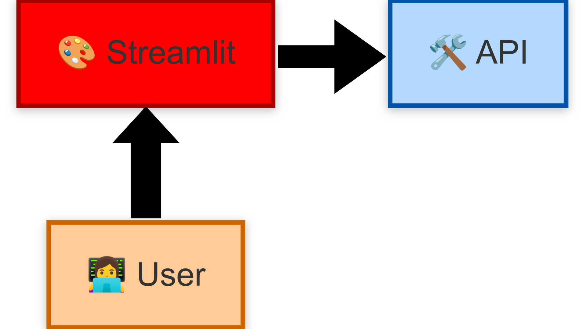

# **Phase 2 : Data Analyst - Exploration et Visualisation**  



## Introduction

**Objectif : Explorer et analyser les données en interrogeant l’API.**  

🔹 **Analyse Exploratoire des Données (EDA)** :  
- Utiliser le **SDK Python** pour requêter l’API et récupérer les données.  
- Identifier les tendances dans les notes des films.  
- Étudier les genres les plus populaires et les préférences des utilisateurs.  

🔹 **Construction d’une Data App avec Streamlit** :  
- Créer une **application interactive** qui permet de visualiser les tendances du cinéma.  
- Intégrer des **tableaux dynamiques** et des **graphiques interactifs**.  
- Offrir une **recherche avancée** des films en fonction des notes et des genres.  

**Livrables** :  
- Un notebook d'analyse exploratoire interactif.  
- Une **application web Streamlit** connectée à l’API qui présente, de manière interactive, les insights aux parties prenantes.

---

## Présentation de Jupyter Notebook

**Jupyter Notebook** est un environnement interactif très populaire dans le monde de la **Data Science**. Il permet d’écrire du code Python, de visualiser des graphiques, d’insérer des textes explicatifs (en Markdown), et de documenter une analyse de données de manière fluide et lisible.

---

### Pourquoi Jupyter Notebook est si populaire ?

🔹 **Interactivité totale** : Chaque cellule de code peut être exécutée indépendamment, ce qui permet d’explorer les données pas à pas.

🔹 **Documentation intégrée** : On peut facilement alterner entre du code Python et des explications en langage naturel (Markdown), ce qui en fait un excellent outil pédagogique et professionnel.

🔹 **Visualisation immédiate** : Les bibliothèques comme `matplotlib`, `seaborn` ou `plotly` s’intègrent parfaitement à Jupyter pour créer des visualisations dynamiques.

🔹 **Support riche** : Intègre du HTML, des tableaux interactifs, des widgets, etc. Parfait pour présenter un projet à un client ou à une équipe.

---

### Un outil central pour le Data Analyst

Durant la phase 2, vous utiliserez Jupyter Notebook pour :

- Charger et explorer les données extraites via votre SDK (et donc indirectement via l’API).
- Réaliser une **analyse exploratoire** complète : tendances, corrélations, genres populaires...
- Visualiser les résultats sous forme de **graphiques** compréhensibles et exploitables.
- Créer un **notebook professionnel** que vous pourrez intégrer dans votre portfolio.

---

Parfait, voici une version retravaillée de la section **Installation rapide** (renommée en **⚙️ Mise en place de l’environnement d’analyse**), adaptée au contexte de la formation, en précisant que l’on travaille avec **VSCode**, un environnement virtuel Python, et un dépôt GitHub :

---

## Mise en place de l’environnement d’analyse

Dans cette formation, nous utilisons **VSCode** comme éditeur principal et organisons chaque phase dans un répertoire Git dédié. Pour cette phase 2 (*Data Analyst – Exploration & Visualisation*), tu vas travailler dans un nouveau projet nommé par exemple `movielens-analytics` (tu crées ton propre répertoire GitHub et tu lui donnes le nom que tu veux)

Voici les étapes pour bien démarrer :

### 1. Cloner le dépôt GitHub du projet

Si ce n’est pas encore fait, commence par cloner le dépôt Git que tu as créé pour cette phase :

```bash
git clone https://github.com/JosueAfouda/movielens-analytics.git
cd movielens-analytics
```

### 2. Créer et activer un environnement virtuel

Ensuite, configure un environnement Python isolé pour gérer les dépendances :

```bash
python3 -m venv .venv
source .venv/bin/activate
```

> Si tu es sur Windows, utilise :  
> `.\.venv\Scripts\activate`

### 3. Ouvrir le projet dans VSCode

```bash
code .
```

Si tu reçois une notification *"Sélectionner l'interpréteur Python"*, choisis l’interpréteur correspondant à ton environnement `.venv`.

### 4. Créer un dossier pour ton notebook

Organise tes fichiers en créant un dossier dédié à l’analyse :

```bash
mkdir dataanalysis
touch dataanalysis/movie_data_analysis.ipynb
```

### 5. Installer le SDK `moviesdk`

Ce SDK te permettra d’interagir avec l’API MovieLens. Installe-le dans ton environnement :

```bash
pip install moviesdk
```

### 6. Lancer et configurer le Jupyter Notebook

Ouvre ton fichier `.ipynb` dans VSCode. Lorsque tu exécutes ta **première cellule**, si Jupyter n’est pas encore installé, VSCode te proposera automatiquement de l’installer (avec `ipykernel`). Accepte pour que tout soit configuré automatiquement.

---

**Ton environnement est prêt !**

Tu peux maintenant démarrer ton **analyse exploratoire interactive** directement dans le fichier `movie_data_analysis.ipynb`.  
On va explorer les films, les notes, les genres... et visualiser tout ça avec des graphiques dynamiques !


Je prévois ceci pour la documentation :

```bash
vant@MOOVE15:~/Documents/business/movielens-analytics$ source .venv/bin/activate
(.venv) vant@MOOVE15:~/Documents/business/movielens-analytics$ code .
(.venv) vant@MOOVE15:~/Documents/business/movielens-analytics$ cd dataanalysis
(.venv) vant@MOOVE15:~/Documents/business/movielens-analytics/dataanalysis$ ls
movie_data_analysis.ipynb  movie_dataviz.ipynb  output
(.venv) vant@MOOVE15:~/Documents/business/movielens-analytics/dataanalysis$ mkdir streamlit_app
(.venv) vant@MOOVE15:~/Documents/business/movielens-analytics/dataanalysis$ cd streamlit_app
(.venv) vant@MOOVE15:~/Documents/business/movielens-analytics/dataanalysis/streamlit_app$ touch movielens_app.py
(.venv) vant@MOOVE15:~/Documents/business/movielens-analytics/dataanalysis/streamlit_app$ touch page1.py
(.venv) vant@MOOVE15:~/Documents/business/movielens-analytics/dataanalysis/streamlit_app$ touch page2.py
(.venv) vant@MOOVE15:~/Documents/business/movielens-analytics/dataanalysis/streamlit_app$ cd ..
(.venv) vant@MOOVE15:~/Documents/business/movielens-analytics/dataanalysis$ cd ..
(.venv) vant@MOOVE15:~/Documents/business/movielens-analytics$ pip install streamlit
Collecting streamlit
  Downloading streamlit-1.44.1-py3-none-any.whl.metadata (8.9 kB)
Collecting altair<6,>=4.0 (from streamlit)
  Downloading altair-5.5.0-py3-none-any.whl.metadata (11 kB)
Collecting blinker<2,>=1.0.0 (from streamlit)
  Using cached blinker-1.9.0-py3-none-any.whl.metadata (1.6 kB)
Collecting cachetools<6,>=4.0 (from streamlit)
  Downloading cachetools-5.5.2-py3-none-any.whl.metadata (5.4 kB)
Collecting click<9,>=7.0 (from streamlit)
  Using cached click-8.1.8-py3-none-any.whl.metadata (2.3 kB)
Requirement already satisfied: numpy<3,>=1.23 in ./.venv/lib/python3.12/site-packages (from streamlit) (2.2.4)
Requirement already satisfied: packaging<25,>=20 in ./.venv/lib/python3.12/site-packages (from streamlit) (24.2)
Requirement already satisfied: pandas<3,>=1.4.0 in ./.venv/lib/python3.12/site-packages (from streamlit) (2.2.3)
Requirement already satisfied: pillow<12,>=7.1.0 in ./.venv/lib/python3.12/site-packages (from streamlit) (11.1.0)
Collecting protobuf<6,>=3.20 (from streamlit)
  Using cached protobuf-5.29.4-cp38-abi3-manylinux2014_x86_64.whl.metadata (592 bytes)
Requirement already satisfied: pyarrow>=7.0 in ./.venv/lib/python3.12/site-packages (from streamlit) (19.0.1)
Collecting requests<3,>=2.27 (from streamlit)
  Using cached requests-2.32.3-py3-none-any.whl.metadata (4.6 kB)
Collecting tenacity<10,>=8.1.0 (from streamlit)
  Downloading tenacity-9.1.2-py3-none-any.whl.metadata (1.2 kB)
Collecting toml<2,>=0.10.1 (from streamlit)
  Downloading toml-0.10.2-py2.py3-none-any.whl.metadata (7.1 kB)
Requirement already satisfied: typing-extensions<5,>=4.4.0 in ./.venv/lib/python3.12/site-packages (from streamlit) (4.13.1)
Collecting watchdog<7,>=2.1.5 (from streamlit)
  Downloading watchdog-6.0.0-py3-none-manylinux2014_x86_64.whl.metadata (44 kB)
     ━━━━━━━━━━━━━━━━━━━━━━━━━━━━━━━━━━━━━━━━ 44.3/44.3 kB 734.0 kB/s eta 0:00:00
Collecting gitpython!=3.1.19,<4,>=3.0.7 (from streamlit)
  Downloading GitPython-3.1.44-py3-none-any.whl.metadata (13 kB)
Collecting pydeck<1,>=0.8.0b4 (from streamlit)
  Downloading pydeck-0.9.1-py2.py3-none-any.whl.metadata (4.1 kB)
Requirement already satisfied: tornado<7,>=6.0.3 in ./.venv/lib/python3.12/site-packages (from streamlit) (6.4.2)
Collecting jinja2 (from altair<6,>=4.0->streamlit)
  Using cached jinja2-3.1.6-py3-none-any.whl.metadata (2.9 kB)
Requirement already satisfied: jsonschema>=3.0 in ./.venv/lib/python3.12/site-packages (from altair<6,>=4.0->streamlit) (4.23.0)
Requirement already satisfied: narwhals>=1.14.2 in ./.venv/lib/python3.12/site-packages (from altair<6,>=4.0->streamlit) (1.34.0)
Collecting gitdb<5,>=4.0.1 (from gitpython!=3.1.19,<4,>=3.0.7->streamlit)
  Downloading gitdb-4.0.12-py3-none-any.whl.metadata (1.2 kB)
Requirement already satisfied: python-dateutil>=2.8.2 in ./.venv/lib/python3.12/site-packages (from pandas<3,>=1.4.0->streamlit) (2.9.0.post0)
Requirement already satisfied: pytz>=2020.1 in ./.venv/lib/python3.12/site-packages (from pandas<3,>=1.4.0->streamlit) (2025.2)
Requirement already satisfied: tzdata>=2022.7 in ./.venv/lib/python3.12/site-packages (from pandas<3,>=1.4.0->streamlit) (2025.2)
Collecting charset-normalizer<4,>=2 (from requests<3,>=2.27->streamlit)
  Using cached charset_normalizer-3.4.1-cp312-cp312-manylinux_2_17_x86_64.manylinux2014_x86_64.whl.metadata (35 kB)
Requirement already satisfied: idna<4,>=2.5 in ./.venv/lib/python3.12/site-packages (from requests<3,>=2.27->streamlit) (3.10)
Collecting urllib3<3,>=1.21.1 (from requests<3,>=2.27->streamlit)
  Using cached urllib3-2.3.0-py3-none-any.whl.metadata (6.5 kB)
Requirement already satisfied: certifi>=2017.4.17 in ./.venv/lib/python3.12/site-packages (from requests<3,>=2.27->streamlit) (2025.1.31)
Collecting smmap<6,>=3.0.1 (from gitdb<5,>=4.0.1->gitpython!=3.1.19,<4,>=3.0.7->streamlit)
  Downloading smmap-5.0.2-py3-none-any.whl.metadata (4.3 kB)
Collecting MarkupSafe>=2.0 (from jinja2->altair<6,>=4.0->streamlit)
  Using cached MarkupSafe-3.0.2-cp312-cp312-manylinux_2_17_x86_64.manylinux2014_x86_64.whl.metadata (4.0 kB)
Requirement already satisfied: attrs>=22.2.0 in ./.venv/lib/python3.12/site-packages (from jsonschema>=3.0->altair<6,>=4.0->streamlit) (25.3.0)
Requirement already satisfied: jsonschema-specifications>=2023.03.6 in ./.venv/lib/python3.12/site-packages (from jsonschema>=3.0->altair<6,>=4.0->streamlit) (2024.10.1)
Requirement already satisfied: referencing>=0.28.4 in ./.venv/lib/python3.12/site-packages (from jsonschema>=3.0->altair<6,>=4.0->streamlit) (0.36.2)
Requirement already satisfied: rpds-py>=0.7.1 in ./.venv/lib/python3.12/site-packages (from jsonschema>=3.0->altair<6,>=4.0->streamlit) (0.24.0)
Requirement already satisfied: six>=1.5 in ./.venv/lib/python3.12/site-packages (from python-dateutil>=2.8.2->pandas<3,>=1.4.0->streamlit) (1.17.0)
Downloading streamlit-1.44.1-py3-none-any.whl (9.8 MB)
   ━━━━━━━━━━━━━━━━━━━━━━━━━━━━━━━━━━━━━━━━ 9.8/9.8 MB 8.8 MB/s eta 0:00:00
Downloading altair-5.5.0-py3-none-any.whl (731 kB)
   ━━━━━━━━━━━━━━━━━━━━━━━━━━━━━━━━━━━━━━━━ 731.2/731.2 kB 8.4 MB/s eta 0:00:00
Using cached blinker-1.9.0-py3-none-any.whl (8.5 kB)
Downloading cachetools-5.5.2-py3-none-any.whl (10 kB)
Using cached click-8.1.8-py3-none-any.whl (98 kB)
Downloading GitPython-3.1.44-py3-none-any.whl (207 kB)
   ━━━━━━━━━━━━━━━━━━━━━━━━━━━━━━━━━━━━━━━━ 207.6/207.6 kB 7.4 MB/s eta 0:00:00
Using cached protobuf-5.29.4-cp38-abi3-manylinux2014_x86_64.whl (319 kB)
Downloading pydeck-0.9.1-py2.py3-none-any.whl (6.9 MB)
   ━━━━━━━━━━━━━━━━━━━━━━━━━━━━━━━━━━━━━━━━ 6.9/6.9 MB 10.0 MB/s eta 0:00:00
Using cached requests-2.32.3-py3-none-any.whl (64 kB)
Downloading tenacity-9.1.2-py3-none-any.whl (28 kB)
Downloading toml-0.10.2-py2.py3-none-any.whl (16 kB)
Downloading watchdog-6.0.0-py3-none-manylinux2014_x86_64.whl (79 kB)
   ━━━━━━━━━━━━━━━━━━━━━━━━━━━━━━━━━━━━━━━━ 79.1/79.1 kB 4.6 MB/s eta 0:00:00
Using cached charset_normalizer-3.4.1-cp312-cp312-manylinux_2_17_x86_64.manylinux2014_x86_64.whl (145 kB)
Downloading gitdb-4.0.12-py3-none-any.whl (62 kB)
   ━━━━━━━━━━━━━━━━━━━━━━━━━━━━━━━━━━━━━━━━ 62.8/62.8 kB 5.7 MB/s eta 0:00:00
Using cached jinja2-3.1.6-py3-none-any.whl (134 kB)
Using cached urllib3-2.3.0-py3-none-any.whl (128 kB)
Using cached MarkupSafe-3.0.2-cp312-cp312-manylinux_2_17_x86_64.manylinux2014_x86_64.whl (23 kB)
Downloading smmap-5.0.2-py3-none-any.whl (24 kB)
Installing collected packages: watchdog, urllib3, toml, tenacity, smmap, protobuf, MarkupSafe, click, charset-normalizer, cachetools, blinker, requests, jinja2, gitdb, pydeck, gitpython, altair, streamlit
Successfully installed MarkupSafe-3.0.2 altair-5.5.0 blinker-1.9.0 cachetools-5.5.2 charset-normalizer-3.4.1 click-8.1.8 gitdb-4.0.12 gitpython-3.1.44 jinja2-3.1.6 protobuf-5.29.4 pydeck-0.9.1 requests-2.32.3 smmap-5.0.2 streamlit-1.44.1 tenacity-9.1.2 toml-0.10.2 urllib3-2.3.0 watchdog-6.0.0
(.venv) vant@MOOVE15:~/Documents/business/movielens-analytics$ cd dataanalysis
(.venv) vant@MOOVE15:~/Documents/business/movielens-analytics/dataanalysis$ cd streamlit_app
(.venv) vant@MOOVE15:~/Documents/business/movielens-analytics/dataanalysis/streamlit_app$ streamlit run movielens_app.py

      👋 Welcome to Streamlit!

      If you’d like to receive helpful onboarding emails, news, offers, promotions,
      and the occasional swag, please enter your email address below. Otherwise,
      leave this field blank.

      Email:  afouda.josue@gmail.com

  You can find our privacy policy at https://streamlit.io/privacy-policy

  Summary:
  - This open source library collects usage statistics.
  - We cannot see and do not store information contained inside Streamlit apps,
    such as text, charts, images, etc.
  - Telemetry data is stored in servers in the United States.
  - If you'd like to opt out, add the following to ~/.streamlit/config.toml,
    creating that file if necessary:

    [browser]
    gatherUsageStats = false


  You can now view your Streamlit app in your browser.

  Local URL: http://localhost:8501
  Network URL: http://192.168.145.86:8501

2025-04-08 19:25:39.964 Uncaught app execution
Traceback (most recent call last):
  File "/home/vant/Documents/business/movielens-analytics/.venv/lib/python3.12/site-packages/streamlit/runtime/scriptrunner/exec_code.py", line 121, in exec_func_with_error_handling
    result = func()
             ^^^^^^
  File "/home/vant/Documents/business/movielens-analytics/.venv/lib/python3.12/site-packages/streamlit/runtime/scriptrunner/script_runner.py", line 640, in code_to_exec
    exec(code, module.__dict__)
  File "/home/vant/Documents/business/movielens-analytics/dataanalysis/streamlit_app/movielens_app.py", line 10, in <module>
    page_1 = st.Page("page1.py", title="Overview", icon=":movie_camera:")
             ^^^^^^^^^^^^^^^^^^^^^^^^^^^^^^^^^^^^^^^^^^^^^^^^^^^^^^^^^^^^
  File "/home/vant/Documents/business/movielens-analytics/.venv/lib/python3.12/site-packages/streamlit/runtime/metrics_util.py", line 410, in wrapped_func
    result = non_optional_func(*args, **kwargs)
             ^^^^^^^^^^^^^^^^^^^^^^^^^^^^^^^^^^
  File "/home/vant/Documents/business/movielens-analytics/.venv/lib/python3.12/site-packages/streamlit/navigation/page.py", line 123, in Page
    return StreamlitPage(
           ^^^^^^^^^^^^^^
  File "/home/vant/Documents/business/movielens-analytics/.venv/lib/python3.12/site-packages/streamlit/navigation/page.py", line 229, in __init__
    validate_icon_or_emoji(self._icon)
  File "/home/vant/Documents/business/movielens-analytics/.venv/lib/python3.12/site-packages/streamlit/string_util.py", line 64, in validate_icon_or_emoji
    return validate_emoji(icon)
           ^^^^^^^^^^^^^^^^^^^^
  File "/home/vant/Documents/business/movielens-analytics/.venv/lib/python3.12/site-packages/streamlit/string_util.py", line 74, in validate_emoji
    raise StreamlitAPIException(
streamlit.errors.StreamlitAPIException: The value ":movie_camera:" is not a valid emoji. Shortcodes are not allowed, please use a single character instead.
^C  Stopping...
(.venv) vant@MOOVE15:~/Documents/business/movielens-analytics/dataanalysis/streamlit_app$ cd ..
(.venv) vant@MOOVE15:~/Documents/business/movielens-analytics/dataanalysis$ tree --prune -I 'build|*.egg-info|__pycache__'
.
├── movie_data_analysis.ipynb
├── movie_dataviz.ipynb
├── output
│   ├── analytics.pkl
│   ├── genre_df.parquet
│   ├── genre_rating_stats.parquet
│   ├── meta_genre_rating_stats.json
│   ├── meta.json
│   ├── meta_movies_by_year.json
│   ├── meta_top_movies.json
│   ├── meta_users_behavior.json
│   ├── movies_by_year.parquet
│   ├── ratings.parquet
│   ├── score_distribution.parquet
│   ├── tags_by_genre.parquet
│   ├── tags_compare.parquet
│   ├── tags_good_rating.parquet
│   ├── top_movies_by_ratings.parquet
│   ├── user_rating_stats.parquet
│   ├── user_sentiment.parquet
│   └── user_tag_stats.parquet
└── streamlit_app
    ├── movielens_app.py
    ├── page1.py
    └── page2.py

3 directories, 23 files
(.venv) vant@MOOVE15:~/Documents/business/movielens-analytics/dataanalysis$ cd streamlit_app
(.venv) vant@MOOVE15:~/Documents/business/movielens-analytics/dataanalysis/streamlit_app$ ls
movielens_app.py  page1.py  page2.py
(.venv) vant@MOOVE15:~/Documents/business/movielens-analytics/dataanalysis/streamlit_app$ streamlit run movielens_app.py

  You can now view your Streamlit app in your browser.

  Local URL: http://localhost:8501
  Network URL: http://192.168.145.86:8501

/home/vant/Documents/business/movielens-analytics/dataanalysis/streamlit_app/page2.py:77: DeprecationWarning:

DataFrameGroupBy.apply operated on the grouping columns. This behavior is deprecated, and in a future version of pandas the grouping columns will be excluded from the operation. Either pass `include_groups=False` to exclude the groupings or explicitly select the grouping columns after groupby to silence this warning.

/home/vant/Documents/business/movielens-analytics/dataanalysis/streamlit_app/page2.py:77: DeprecationWarning:

DataFrameGroupBy.apply operated on the grouping columns. This behavior is deprecated, and in a future version of pandas the grouping columns will be excluded from the operation. Either pass `include_groups=False` to exclude the groupings or explicitly select the grouping columns after groupby to silence this warning.

/home/vant/Documents/business/movielens-analytics/dataanalysis/streamlit_app/page2.py:77: DeprecationWarning:

DataFrameGroupBy.apply operated on the grouping columns. This behavior is deprecated, and in a future version of pandas the grouping columns will be excluded from the operation. Either pass `include_groups=False` to exclude the groupings or explicitly select the grouping columns after groupby to silence this warning.

/home/vant/Documents/business/movielens-analytics/dataanalysis/streamlit_app/page2.py:77: DeprecationWarning:

DataFrameGroupBy.apply operated on the grouping columns. This behavior is deprecated, and in a future version of pandas the grouping columns will be excluded from the operation. Either pass `include_groups=False` to exclude the groupings or explicitly select the grouping columns after groupby to silence this warning.

/home/vant/Documents/business/movielens-analytics/dataanalysis/streamlit_app/page2.py:77: DeprecationWarning:

DataFrameGroupBy.apply operated on the grouping columns. This behavior is deprecated, and in a future version of pandas the grouping columns will be excluded from the operation. Either pass `include_groups=False` to exclude the groupings or explicitly select the grouping columns after groupby to silence this warning.

/home/vant/Documents/business/movielens-analytics/dataanalysis/streamlit_app/page2.py:77: DeprecationWarning:

DataFrameGroupBy.apply operated on the grouping columns. This behavior is deprecated, and in a future version of pandas the grouping columns will be excluded from the operation. Either pass `include_groups=False` to exclude the groupings or explicitly select the grouping columns after groupby to silence this warning.

/home/vant/Documents/business/movielens-analytics/dataanalysis/streamlit_app/page2.py:77: DeprecationWarning:

DataFrameGroupBy.apply operated on the grouping columns. This behavior is deprecated, and in a future version of pandas the grouping columns will be excluded from the operation. Either pass `include_groups=False` to exclude the groupings or explicitly select the grouping columns after groupby to silence this warning.

/home/vant/Documents/business/movielens-analytics/dataanalysis/streamlit_app/page2.py:77: DeprecationWarning:

DataFrameGroupBy.apply operated on the grouping columns. This behavior is deprecated, and in a future version of pandas the grouping columns will be excluded from the operation. Either pass `include_groups=False` to exclude the groupings or explicitly select the grouping columns after groupby to silence this warning.

/home/vant/Documents/business/movielens-analytics/dataanalysis/streamlit_app/page2.py:77: DeprecationWarning:

DataFrameGroupBy.apply operated on the grouping columns. This behavior is deprecated, and in a future version of pandas the grouping columns will be excluded from the operation. Either pass `include_groups=False` to exclude the groupings or explicitly select the grouping columns after groupby to silence this warning.

/home/vant/Documents/business/movielens-analytics/dataanalysis/streamlit_app/page2.py:77: DeprecationWarning:

DataFrameGroupBy.apply operated on the grouping columns. This behavior is deprecated, and in a future version of pandas the grouping columns will be excluded from the operation. Either pass `include_groups=False` to exclude the groupings or explicitly select the grouping columns after groupby to silence this warning.

/home/vant/Documents/business/movielens-analytics/dataanalysis/streamlit_app/page2.py:77: DeprecationWarning:

DataFrameGroupBy.apply operated on the grouping columns. This behavior is deprecated, and in a future version of pandas the grouping columns will be excluded from the operation. Either pass `include_groups=False` to exclude the groupings or explicitly select the grouping columns after groupby to silence this warning.

/home/vant/Documents/business/movielens-analytics/dataanalysis/streamlit_app/page2.py:77: DeprecationWarning:

DataFrameGroupBy.apply operated on the grouping columns. This behavior is deprecated, and in a future version of pandas the grouping columns will be excluded from the operation. Either pass `include_groups=False` to exclude the groupings or explicitly select the grouping columns after groupby to silence this warning.

/home/vant/Documents/business/movielens-analytics/dataanalysis/streamlit_app/page2.py:77: DeprecationWarning:

DataFrameGroupBy.apply operated on the grouping columns. This behavior is deprecated, and in a future version of pandas the grouping columns will be excluded from the operation. Either pass `include_groups=False` to exclude the groupings or explicitly select the grouping columns after groupby to silence this warning.

/home/vant/Documents/business/movielens-analytics/dataanalysis/streamlit_app/page2.py:77: DeprecationWarning:

DataFrameGroupBy.apply operated on the grouping columns. This behavior is deprecated, and in a future version of pandas the grouping columns will be excluded from the operation. Either pass `include_groups=False` to exclude the groupings or explicitly select the grouping columns after groupby to silence this warning.

/home/vant/Documents/business/movielens-analytics/dataanalysis/streamlit_app/page2.py:77: DeprecationWarning:

DataFrameGroupBy.apply operated on the grouping columns. This behavior is deprecated, and in a future version of pandas the grouping columns will be excluded from the operation. Either pass `include_groups=False` to exclude the groupings or explicitly select the grouping columns after groupby to silence this warning.


```

Pour la Doc du process d'affichage des images des films et de leurs liens :

Site de création de l'API : https://www.omdbapi.com/apikey.aspx?__EVENTTARGET=&__EVENTARGUMENT=&__LASTFOCUS=&__VIEWSTATE=%2FwEPDwUKLTIwNDY4MTIzNQ9kFgYCAQ9kFggCAQ8QDxYCHgdDaGVja2VkaGRkZGQCAw8QDxYCHwBnZGRkZAIFDxYCHgdWaXNpYmxlaGQCBw8WAh8BZ2QCAg8WAh8BaGQCAw8WAh8BaGQYAQUeX19Db250cm9sc1JlcXVpcmVQb3N0QmFja0tleV9fFgMFC3BhdHJlb25BY2N0BQtwYXRyZW9uQWNjdAUIZnJlZUFjY3SZmkfBgEVOtEhBRPgn0xJZZDjfMEiMoho3O8lIVPYLXg%3D%3D&__VIEWSTATEGENERATOR=5E550F58&__EVENTVALIDATION=%2FwEdAAhq8u7G6E8iNQTDLBqGZykXmSzhXfnlWWVdWIamVouVTzfZJuQDpLVS6HZFWq5fYphdL1XrNEjnC%2FKjNya%2Bmqh8hRPnM5dWgso2y7bj7kVNLSFbtYIt24Lw6ktxrd5Z67%2F4LFSTzFfbXTFN5VgQX9Nbzfg78Z8BXhXifTCAVkevd2U20ItIGqFIf8giu%2B0PAasvwu4KgXUo9rywyT%2ByOXGt&at=freeAcct&Email2=afouda.josue%40gmail.com&FirstName=JOSUE&LastName=AFOUDA&TextArea1=a+small+streamlit+app+for+learning+using+API&Button1=Submit

On recoit un mail :

Here is your key: 135f1ef

Please append it to all of your API requests,

OMDb API: http://www.omdbapi.com/?i=tt3896198&apikey=135f1ef

Click the following URL to activate your key: http://www.omdbapi.com/apikey.aspx?VERIFYKEY=e8e6d461-750a-45fe-8de6-b8b9cf377e3a
If you did not make this request, please disregard this email.

On active l'API en cliquant sur le lien

Exécuter script get_movie_poster.py 

Petite modification dans page3.py

ça fonctionne bien

J'essaie quand même de télécharger les images en local : script download_movie_poster.py


